# rEAMember

This project is an implementation of the paper "Imagery in the entropic associative memory" by [Luis A. Pineda et al.](https://www.nature.com/articles/s41598-023-36761-6).

> The Entropic Associative Memory (EAM) is a novel computational memory model in which functions representing arbitrary concrete or abstract objects are stored in a bi-dimensional array or table, called Associative Memory Register (AMR), which is used as the representational medium. The columns and the rows stand for the arguments and their values, respectively, and the functional relation is represented by filling up the cell at the corresponding intersection, for all the columns. Hence, every object is stored by marking up one cell of each column in the AMR, and can be thought of as a memory trace. 

## Usage

```bash
uv run manage.py [command]
```

For example:

```bash
uv run manage.py get-embeddings --config ./config/spots-256.yml
```
This command will generate embeddings for the dataset specified in the configuration file `spots-256.yml`.

## Available Commands

Run: 

```bash
uv run manage.py --help
```

## Docs

```bash
uv run pdoc manage.py reamember
```

## Diagram (Mermaid)

```mermaid
graph TD

    1878["User<br>External Actor"]
    1890["User<br>External Actor"]
    1895["Configuration Files<br>YAML"]
    subgraph 1877["CLI Application<br>Python, Click"]
        1879["CLI Orchestrator<br>Python, Click"]
        1880["Configuration<br>Python, OmegaConf"]
        1881["Data Management<br>Python, PyTorch"]
        1882["Neural Networks<br>PyTorch, PyTorch Lightning"]
        1883["Memory Operations<br>Python, PyTorch"]
        1884["Model Training<br>PyTorch Lightning"]
        1885["Embedding Generation<br>PyTorch, PCA"]
        1886["Associative Memory<br>PyTorch"]
        %% Edges at this level (grouped by source)
        1879["CLI Orchestrator<br>Python, Click"] -->|loads config| 1880["Configuration<br>Python, OmegaConf"]
        1879["CLI Orchestrator<br>Python, Click"] -->|manages data| 1881["Data Management<br>Python, PyTorch"]
        1879["CLI Orchestrator<br>Python, Click"] -->|performs memory ops| 1883["Memory Operations<br>Python, PyTorch"]
        1879["CLI Orchestrator<br>Python, Click"] -->|trains models| 1884["Model Training<br>PyTorch Lightning"]
        1879["CLI Orchestrator<br>Python, Click"] -->|generates embeddings| 1885["Embedding Generation<br>PyTorch, PCA"]
        1884["Model Training<br>PyTorch Lightning"] -->|accesses data| 1881["Data Management<br>Python, PyTorch"]
        1884["Model Training<br>PyTorch Lightning"] -->|uses models| 1882["Neural Networks<br>PyTorch, PyTorch Lightning"]
        1885["Embedding Generation<br>PyTorch, PCA"] -->|accesses data| 1881["Data Management<br>Python, PyTorch"]
        1885["Embedding Generation<br>PyTorch, PCA"] -->|uses models| 1882["Neural Networks<br>PyTorch, PyTorch Lightning"]
        1883["Memory Operations<br>Python, PyTorch"] -->|uses models| 1882["Neural Networks<br>PyTorch, PyTorch Lightning"]
        1883["Memory Operations<br>Python, PyTorch"] -->|utilizes| 1886["Associative Memory<br>PyTorch"]
        1882["Neural Networks<br>PyTorch, PyTorch Lightning"] -->|defines models| 1886["Associative Memory<br>PyTorch"]
    end
    subgraph 1887["Data Sources<br>Image/Text Datasets"]
        1897["External Datasets<br>Image/Text"]
    end
    subgraph 1888["Experiment Outputs<br>Model Checkpoints, Images"]
        1896["Models &amp; Results<br>PyTorch, PNG"]
    end
    subgraph 1889["CLI Tool<br>Python, Click"]
        1891["Management Script<br>Python, Click"]
        1892["Core Logic<br>Python"]
        1893["Neural Networks<br>PyTorch, PyTorch Lightning"]
        1894["Associative Memory<br>Python"]
        %% Edges at this level (grouped by source)
        1892["Core Logic<br>Python"] -->|trains models| 1893["Neural Networks<br>PyTorch, PyTorch Lightning"]
        1892["Core Logic<br>Python"] -->|uses memory| 1894["Associative Memory<br>Python"]
        1891["Management Script<br>Python, Click"] -->|orchestrates training| 1892["Core Logic<br>Python"]
    end
    %% Edges at this level (grouped by source)
    1878["User<br>External Actor"] -->|invokes commands| 1879["CLI Orchestrator<br>Python, Click"]
    1892["Core Logic<br>Python"] -->|processes data| 1887["Data Sources<br>Image/Text Datasets"]
    1893["Neural Networks<br>PyTorch, PyTorch Lightning"] -->|saves models| 1888["Experiment Outputs<br>Model Checkpoints, Images"]
    1890["User<br>External Actor"] -->|invokes commands| 1891["Management Script<br>Python, Click"]
    1891["Management Script<br>Python, Click"] -->|loads config| 1895["Configuration Files<br>YAML"]
    1897["External Datasets<br>Image/Text"] -->|provides data| 1892["Core Logic<br>Python"]
```

